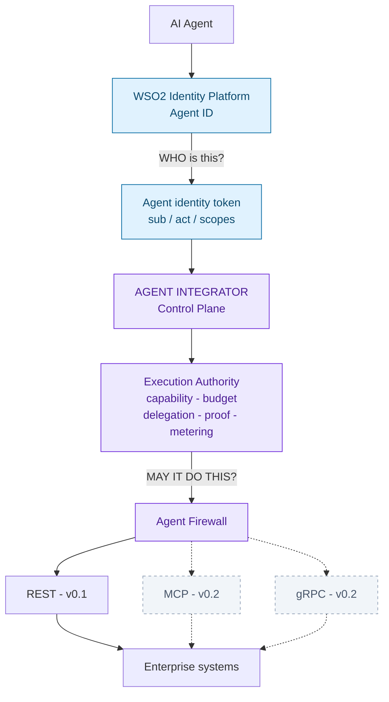
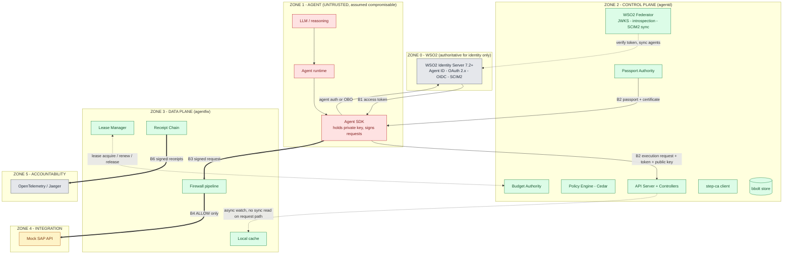
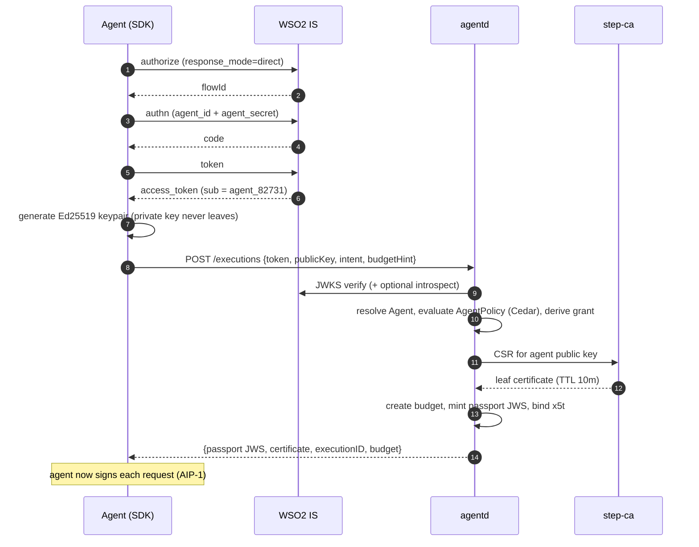
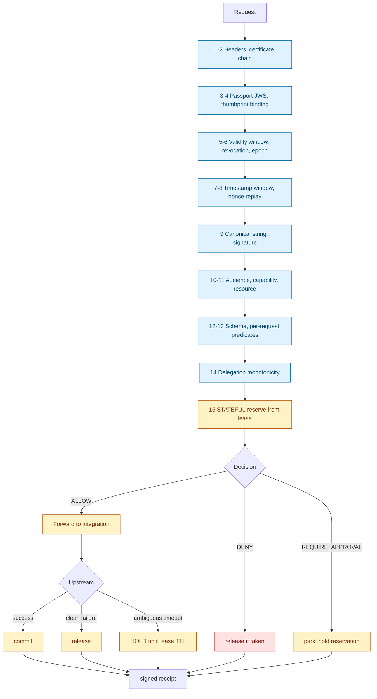

# Agent Integrator (v0.1)

**Technical report and implementation guide for the v0.1.0 release.**
Identity provider: **WSO2 Identity Platform (Agent ID)**.

| Field             | Value                                           |
| ----------------- | ----------------------------------------------- |
| Document version  | 4.0 — v0.1-targeted                             |
| Date              | 15 August 2026                                  |
| Release target    | `v0.1.0`, 14 weeks                              |
| Language          | Go 1.23+                                        |
| License           | Apache License 2.0                              |
| API group         | `agentintegrator.dev/v1alpha1`                  |
| Wire spec         | AIP-1/v0.1                                      |
| IdP               | WSO2 Identity Server 7.2+ / Asgardeo (Agent ID) |
| Protocols in v0.1 | HTTP/REST only (MCP and gRPC deferred to v0.2)  |

---

# Monorepo Structure

Scaffold for the Agent Integrator v0.1 monorepo. Generated by `scaffold.sh`,
which is idempotent — re-run it any time to add newly-defined directories
without touching files you have already written.

```bash
./scaffold.sh                 # creates ./agent-integrator
./scaffold.sh ~/code/ai       # or into a path you choose
cd agent-integrator && git init && git add -A && git commit -s -m "chore: scaffold monorepo"
```

## Module layout

Three Go modules, deliberately:

| Module    | Path      | Why separate                                                                           |
| --------- | --------- | -------------------------------------------------------------------------------------- |
| Core      | `/`       | Control plane, data plane, CLI, API types                                              |
| SDK       | `/sdk/go` | Agent authors must not pull the control plane and its dependency tree into their agent |
| Benchmark | `/abench` | Heavy test-only dependencies; also a standalone citable artefact                       |

## The three citable artefacts

`spec/`, `formal/` and `abench/` are self-contained and independently
publishable. This is the durability strategy: architectures get subsumed by
standards, but a wire specification, a machine-checked model, and a benchmark
outlive the implementation that produced them.

## Directory rationale

| Path                         | Contents                                                     | Notes                                                                         |
| ---------------------------- | ------------------------------------------------------------ | ----------------------------------------------------------------------------- |
| `spec/`                      | AIP-1 wire specification, conformance vectors, JSON schemas  | Freeze in build week 7; changes require a version bump and new vectors        |
| `formal/`                    | `budget.tla`, `protocol.spthy`, `delegation.spthy`           | Model the lease protocol **before** writing `pkg/budget`                      |
| `abench/`                    | Baselines A–P, harness, pre-registered protocol, raw results | Never edit `results/` after the fact                                          |
| `api/v1alpha1/`              | Seven kinds, one file each                                   | `DecisionReceipt` is emitted, never authored                                  |
| `cmd/`                       | `agentd`, `agentfw`, `agentctl`                              | Three binaries, no more                                                       |
| `internal/`                  | Controllers and API server internals                         | Not importable by downstream projects — keeps the public surface small        |
| `pkg/identity/wso2/`         | Federation, `act`/`sub` resolution, SCIM2 sync               | Keep the `Federator` interface clean so a second IdP proves vendor-neutrality |
| `pkg/budget/`                | ★ Lease protocol                                             | The novel core                                                                |
| `pkg/delegation/`            | ★ Monotonicity verifier                                      | The novel core                                                                |
| `pkg/receipt/`               | ★ Hash-chained signed receipts                               | The novel core                                                                |
| `pkg/firewall/stages/`       | One file per pipeline stage, numbered `01`–`15`              | Numbering encodes execution order; stage 15 is the only mutating one          |
| `pkg/apierr/`                | Stable `AI-xxxx` reason codes                                | Public API — append only, never renumber                                      |
| `sdk/go/`                    | Agent-side signing client                                    | Separate module                                                               |
| `deploy/docker/wso2/seed.sh` | Scripted WSO2 provisioning                                   | No manual console clicks; one-command reproducibility is the point            |
| `docs/adr/`                  | Architecture decision records                                | Write them while deciding, not after                                          |
| `test/adversarial/`          | One test per threat T1–T16                                   | A new denial path requires a new test in the same PR                          |

★ = novel core. Cut anything else before cutting these.

## Conventions worth keeping

- **Firewall stages are numbered files.** `01_headers.go` through
  `15_budget.go`. Anyone can read the execution order from `ls`, and per-stage
  latency attribution falls out of one instrumentation wrapper.
- **`internal/` over `pkg/` when in doubt.** Everything in `pkg/` is a promise
  to downstream users; everything in `internal/` can be refactored freely.
- **Two firewall replicas in every dev and CI environment.** The lease protocol
  is only exercised when budget is shared across more than one enforcement
  point — a single replica hides every interesting bug.
- **The PR template carries the invariant checklist.** Fail-closed behaviour and
  lease pre-deduction are easy to break accidentally and hard to catch in review.

## Full tree

````
agent-integrator/
├── .github/
│   ├── ISSUE_TEMPLATE/
│   │   ├── bug_report.md
│   │   └── security_note.md
│   ├── pull_request_template.md
│   └── workflows/
│       ├── ci.yaml
│       ├── fuzz.yaml
│       └── release.yaml
├── .gitignore
├── .golangci.yaml
├── .goreleaser.yaml
├── CODE_OF_CONDUCT.md
├── CONTRIBUTING.md
├── GOVERNANCE.md
├── LICENSE
├── MAINTAINERS.md
├── Makefile
├── PROJECT.md
├── README.md
├── ROADMAP.md
├── SECURITY.md
├── abench/
│   ├── README.md
│   ├── go.mod
│   ├── harness/
│   ├── results/
│   └── scenarios/
├── adapters/
│   ├── http/
│   │   └── README.md
│   └── mocksap/
│       └── README.md
├── api/
│   └── v1alpha1/
│       ├── agent_types.go
│       ├── agentexecution_types.go
│       ├── agentpassport_types.go
│       ├── agentpolicy_types.go
│       ├── capability_types.go
│       ├── common_types.go
│       ├── decisionreceipt_types.go
│       ├── doc.go
│       └── integration_types.go
├── cmd/
│   ├── agentctl/
│   │   └── main.go
│   ├── agentd/
│   │   └── main.go
│   └── agentfw/
│       └── main.go
├── deploy/
│   ├── docker/
│   │   ├── docker-compose.yaml
│   │   ├── stepca/
│   │   └── wso2/
│   │       └── seed.sh
│   ├── helm/
│   │   └── agent-integrator/
│   │       ├── Chart.yaml
│   │       ├── templates/
│   │       └── values.yaml
│   └── kubernetes/
├── docs/
│   ├── README.md
│   ├── adr/
│   │   ├── 0004-pre-deducted-leases.md
│   │   └── README.md
│   ├── concepts/
│   ├── getting-started/
│   ├── operations/
│   └── reference/
├── examples/
│   ├── policies/
│   │   └── procurement-policy.yaml
│   └── procurement/
│       └── README.md
├── formal/
│   ├── README.md
│   ├── budget.tla
│   └── check.sh
├── go.mod
├── hack/
│   └── setup-dev.sh
├── internal/
│   ├── apiserver/
│   ├── controller/
│   │   ├── agent/
│   │   ├── integration/
│   │   ├── policy/
│   │   └── wso2sync/
│   └── version/
├── pkg/
│   ├── apierr/
│   │   └── codes.go
│   ├── authority/
│   │   └── policy.go
│   ├── budget/
│   │   ├── authority.go
│   │   └── lease.go
│   ├── crypto/
│   │   └── canonical.go
│   ├── delegation/
│   │   └── chain.go
│   ├── firewall/
│   │   ├── pipeline.go
│   │   └── stages/
│   │       ├── 01_headers.go
│   │       ├── 02_certificate.go
│   │       ├── 03_passport.go
│   │       ├── 04_binding.go
│   │       ├── 05_validity.go
│   │       ├── 06_revocation.go
│   │       ├── 07_timestamp.go
│   │       ├── 08_nonce.go
│   │       ├── 09_signature.go
│   │       ├── 10_audience.go
│   │       ├── 11_capability.go
│   │       ├── 12_schema.go
│   │       ├── 13_constraints.go
│   │       ├── 14_delegation.go
│   │       └── 15_budget.go
│   ├── identity/
│   │   └── wso2/
│   │       ├── federator.go
│   │       └── scimsync.go
│   ├── integration/
│   │   └── adapter.go
│   ├── passport/
│   │   └── authority.go
│   ├── receipt/
│   │   └── chain.go
│   ├── store/
│   │   ├── bbolt/
│   │   └── store.go
│   └── telemetry/
│       └── otel.go
├── sdk/
│   └── go/
│       ├── README.md
│       ├── client.go
│       ├── examples/
│       └── go.mod
├── spec/
│   ├── AIP-1.md
│   ├── README.md
│   ├── conformance/
│   │   ├── README.md
│   │   └── vectors/
│   └── schemas/
├── test/
│   ├── adversarial/
│   │   └── README.md
│   ├── conformance/
│   ├── e2e/
│   │   └── README.md
│   ├── fuzz/
│   └── property/
│       └── README.md
└── tools/```

## Table of Contents

1. [v0.1 Objective](#1-v01-objective)
2. [Problem, in One Page](#2-problem-in-one-page)
3. [Scope](#3-scope)
4. [Architecture](#4-architecture)
5. [WSO2 Integration Specification](#5-wso2-integration-specification)
6. [Division of Labour: WSO2 vs Agent Integrator](#6-division-of-labour-wso2-vs-agent-integrator)
7. [Boundaries](#7-boundaries)
8. [Resource Schemas](#8-resource-schemas)
9. [AIP-1 Wire Specification](#9-aip-1-wire-specification)
10. [Budget Lease Protocol](#10-budget-lease-protocol)
11. [Delegation](#11-delegation)
12. [Receipt Chain](#12-receipt-chain)
13. [Firewall Decision Pipeline](#13-firewall-decision-pipeline)
14. [Go Package Interfaces](#14-go-package-interfaces)
15. [Error Codes](#15-error-codes)
16. [Storage Layout](#16-storage-layout)
17. [Configuration](#17-configuration)
18. [CLI Reference](#18-cli-reference)
19. [Deployment](#19-deployment)
20. [Observability](#20-observability)
21. [Threat Model](#21-threat-model)
22. [Testing and Acceptance](#22-testing-and-acceptance)
23. [Formal Verification](#23-formal-verification)
24. [Benchmark Protocol](#24-benchmark-protocol)
25. [14-Week Build Plan](#25-14-week-build-plan)
26. [Repository Structure](#26-repository-structure)
27. [Beyond v0.1](#27-beyond-v01)
28. [Glossary](#28-glossary)

---

## 1. v0.1 Objective

> **Ship one vertical slice, end to end, reproducible from a clean machine:** a WSO2-authenticated AI agent obtains a short-lived, budget-limited Agent Passport, signs each HTTP request, and has that request verified, metered, and allowed or denied by the Agent Firewall in front of a mock SAP integration — with a signed, verifiable receipt for every decision.

Nothing else ships in v0.1. Everything in §27 is deliberately deferred.

**Success bar:**

```bash
git clone https://github.com/<org>/agent-integrator
cd agent-integrator && make dev-up && make demo
# 14/14 acceptance scenarios pass, including budget exhaustion
````

---

## 2. Problem, in One Page

WSO2 Identity Server answers **"who is this agent?"** — and answers it well: agents are first-class identities with their own lifecycle, credentials, roles, delegation and revocation.

What no identity system answers is **"may it do this, right now, and how much of its allowance is left?"**

An agent authorised for "create purchase orders, max $10,000" can create four hundred $9,999 purchase orders in five minutes. Every one satisfies its scopes. Every one satisfies per-request policy. OAuth scopes, IAM conditions, gateway quotas and capability tokens are all **stateless and per-request** — none of them bound the _campaign_.

Agent Integrator adds the missing layer:

| Question                                                 | Answered by                                 |
| -------------------------------------------------------- | ------------------------------------------- |
| Who is this agent?                                       | **WSO2 Identity Platform**                  |
| On whose behalf is it acting?                            | **WSO2** (`act` claim, OBO/CIBA)            |
| What may it do, where, within what limits, for how long? | **Agent Integrator — Control Plane**        |
| Did it really send _this exact_ request?                 | **Agent Integrator — request signature**    |
| How much of its allowance remains?                       | **Agent Integrator — budget lease**         |
| Is this specific action permitted right now?             | **Agent Integrator — Agent Firewall**       |
| Can we prove what happened afterwards?                   | **Agent Integrator — signed receipt chain** |

---

## 3. Scope

### In scope for v0.1

**Control plane** — API server (CRUD + watch); bbolt store; `Agent`, `Capability`, `AgentPolicy`, `Integration`, `AgentExecution`, `AgentPassport`; controllers; **WSO2 federation** (autonomous + OBO); Cedar policy evaluation; Passport Authority; **Budget Authority with leases**; step-ca certificate issuance; revocation via epochs.

**Data plane** — HTTP Agent Firewall; certificate, passport and signature verification; replay protection; audience, capability, schema and per-request constraint checks; **cumulative budget enforcement**; delegation chain verification; ALLOW / DENY / REQUIRE_APPROVAL; signed receipt chain; mock SAP adapter.

**Developer experience** — `agentctl`; Go SDK; docker-compose stack including a seeded WSO2; Helm chart; OpenTelemetry; docs site; 14 CI-gated acceptance scenarios.

### Out of scope for v0.1 (hold this line)

MCP adapter · gRPC adapter · real SAP · credential broker · HITL approval UI (the decision exists; the UI does not) · etcd HA · offline delegation · multi-region · SPIFFE · additional IdPs · **the React UI**.

---

## 4. Architecture

### 4.1 Layer view



Dashed = deferred to v0.2.

### 4.2 Trust zones



### 4.3 Invariants (non-negotiable)

| #   | Invariant                                                                                            |
| --- | ---------------------------------------------------------------------------------------------------- |
| I1  | The data plane performs **no synchronous store or WSO2 call** on the request path.                   |
| I2  | Any verification failure, missing trust material, or stale cache → **DENY** (fail closed).           |
| I3  | The passport private key **never leaves** the agent; the control plane never persists it.            |
| I4  | CA private keys are **unreachable** from the data plane.                                             |
| I5  | `S ≤ B` — total spend never exceeds the execution budget, under arbitrary crashes and partitions.    |
| I6  | Delegation is **monotonic**: a child's authority is a subset of its parent's on every dimension.     |
| I7  | **Every** decision — allow and deny — emits a signed receipt.                                        |
| I8  | The decision path is **deterministic**: no model inference, no calls except the forwarded request.   |
| I9  | Kubernetes is a deployment target, **not a requirement**.                                            |
| I10 | WSO2 is authoritative for identity; Agent Integrator **never** issues identity or mints WSO2 tokens. |

---

## 5. WSO2 Integration Specification

WSO2 Identity Server treats AI agents as first-class identities with their own lifecycle, credentials, roles and revocation, and supports both autonomous agent authentication and delegated on-behalf-of flows built on OAuth 2.x / OIDC / SCIM2. v0.1 consumes exactly three things from it: **a verifiable token**, **an agent identifier**, and **the agent roster**.

### 5.1 Mode A — Agent acting on its own (v0.1 default)

The agent authenticates with its **Agent ID** and **Agent Secret** through WSO2's non-redirect agent flow:

```
POST /t/{org}/oauth2/authorize   response_mode=direct            -> flowId
POST /t/{org}/oauth2/authn       flowId + agent_id/agent_secret  -> code
POST /t/{org}/oauth2/token       grant_type=authorization_code   -> access_token
```

Resulting token (autonomous):

```json
{
  "iss": "https://wso2.acme.example/t/acme/oauth2/token",
  "sub": "agent_82731",
  "aud": "agent-integrator",
  "scope": "purchase_order.read purchase_order.create",
  "exp": 1786000000
}
```

`sub` is the agent identifier. Agent Integrator maps it to a registered `Agent` (§5.4).

### 5.2 Mode B — Agent acting on behalf of a user

WSO2 issues a **delegated token carrying an `act` claim** naming the agent, with `sub` naming the human. For background agents with no user present, WSO2 supports CIBA: the agent sends its `actor_token` to the backchannel endpoint and the user approves asynchronously on another device.

```json
{
  "sub": "j.silva",
  "act": { "sub": "agent_82731" },
  "scope": "purchase_order.create",
  "exp": 1786000000
}
```

**Resolution rule (normative):**

```
if token.act.sub exists:
    agentSubject   := token.act.sub      // the acting agent
    humanPrincipal := token.sub          // recorded in passport + every receipt
else:
    agentSubject   := token.sub
    humanPrincipal := null
```

The human principal is carried into the passport and stamped into every receipt. This is a real benefit of choosing WSO2: the audit trail names both the agent and the human it acted for, without Agent Integrator inventing a delegation model of its own.

### 5.3 Token verification (control plane only — never on the request path)

1. Fetch and cache JWKS from the WSO2 well-known configuration (refresh every 5 minutes, backoff on failure).
2. Verify signature; `iss` against the allow-list; `aud` contains `agent-integrator`; `exp`/`nbf` with ≤2 s skew.
3. Reject reused token JTIs within the issuance window.
4. Optionally call WSO2 introspection when `identity.introspect: true` — recommended, so WSO2 revocation takes effect at issuance time.
5. Resolve `agentSubject` → `Agent`. No mapping → `AI-1101`.

> **Design note:** token verification happens **only at passport issuance**, never per request. That is what keeps WSO2 off the hot path and preserves I1. A revoked WSO2 agent cannot obtain new passports; existing passports are killed by epoch bump (§5.5).

### 5.4 Agent mapping and SCIM2 sync

**Explicit (default).** The operator declares the mapping:

```yaml
spec:
  identity:
    provider: wso2
    issuer: https://wso2.acme.example/t/acme/oauth2/token
    subject: agent_82731 # WSO2 Agent ID
```

**Synced (optional).** An `AgentSyncController` polls WSO2 SCIM2 every `syncInterval` and materialises discovered agents as `Agent` resources, with labels derived from WSO2 roles:

```
WSO2 role "Procurement-Specialist"  ->  label  wso2.role/procurement-specialist: "true"
```

Those labels feed `AgentPolicy.spec.agentSelector`, so **an operator can grant execution authority by WSO2 role** without maintaining a second roster. Synced agents carry `spec.managedBy: wso2` and are never mutated locally.

### 5.5 Revocation propagation

| WSO2 event                                     | Agent Integrator response                                                                                                       |
| ---------------------------------------------- | ------------------------------------------------------------------------------------------------------------------------------- |
| Agent disabled or deleted (SCIM2 sync detects) | `Agent.status.phase = Suspended`; **epoch bump** → all outstanding passports and leases invalid within one propagation interval |
| Token revoked (detected at introspection)      | Issuance denied (`AI-1104`)                                                                                                     |
| Role removed                                   | Selector no longer matches; new passports denied; existing passports live out their ≤5-minute TTL                               |

Short passport TTL is the primary defence; the epoch bump is the emergency stop.

### 5.6 Issuance sequence



### 5.7 What Agent Integrator must never do to WSO2

- Never mint, re-sign or extend a WSO2 token.
- Never treat a WSO2 scope as authority — scopes are an input to policy, never a grant. A token bearing `purchase_order.create` still yields no authority without a matching `AgentPolicy`.
- Never call WSO2 on the request path.
- Never store the agent secret.

---

## 6. Division of Labour: WSO2 vs Agent Integrator

Keep this table in the README. It is the answer to "isn't this what WSO2 already does?" — in reviews, in CNCF discussion, and in interviews.

| Concern                                          | WSO2 Identity Platform  | Agent Integrator                        |
| ------------------------------------------------ | ----------------------- | --------------------------------------- |
| Agent registration and lifecycle                 | Authoritative           | Consumes via SCIM2                      |
| Agent authentication                             | Agent ID + Secret, CIBA | Never                                   |
| Human consent and on-behalf-of                   | `act` claim, OBO, CIBA  | Records it in passport and receipts     |
| Coarse permissions                               | Roles, scopes           | Input to policy, not a grant            |
| Token issuance and revocation                    | Yes                     | Never                                   |
| **Execution-scoped authority**                   | —                       | **Yes**                                 |
| **Per-request value constraints**                | —                       | **Yes**                                 |
| **Cumulative budgets (spend, calls, resources)** | —                       | **Yes**                                 |
| **Per-request cryptographic proof of payload**   | —                       | **Yes**                                 |
| **Runtime enforcement at the integration**       | —                       | **Yes**                                 |
| **Signed, hash-chained decision receipts**       | Audit logs              | **Verifiable offline by third parties** |
| **Distributed metering with a proven bound**     | —                       | **Yes**                                 |

One line: **WSO2 issues the identity; Agent Integrator issues and meters the allowance.**

---

## 7. Boundaries

| ID     | Boundary                  | Crosses                                                | Checks                                                                                                     | Failure                                     |
| ------ | ------------------------- | ------------------------------------------------------ | ---------------------------------------------------------------------------------------------------------- | ------------------------------------------- |
| **B1** | WSO2 → Control Plane      | Access token (`sub` or `act.sub`)                      | JWKS signature, issuer allow-list, `aud`, `exp`/`nbf`, JTI replay, optional introspection, subject→`Agent` | Reject; no passport                         |
| **B2** | Control Plane → Agent     | Passport JWS + certificate (private key never crosses) | Authority derived, never requested; budget allocated; no privilege amplification                           | Deny issuance, record reason                |
| **B3** | Agent → Data Plane        | Request + passport + certificate + signature           | Chain to root, `x5t#S256` binding, canonical signature, timestamp, nonce, payload hash                     | Reject before policy evaluation             |
| **B4** | Data Plane → Integration  | ALLOW-only actions                                     | Audience, capability, resource, schema, per-request constraints, revocation, **budget reservation**        | DENY (fail closed) / REQUIRE_APPROVAL       |
| **B5** | Broker → Integration auth | _(v0.2)_ native short-lived credential                 | Never broader or longer-lived than the passport                                                            | Deny; never fall back to static credentials |
| **B6** | Data Plane → Audit        | Signed receipts, traces                                | Required fields present; hashes not payloads                                                               | Never blocks decisions; audit loss alerts   |
| **B7** | Tenant ⇄ Tenant           | **Nothing**                                            | Namespace scoping, audience binding, WSO2 org (`/t/{org}`) isolation                                       | Deny + security event                       |
| **B8** | Scope                     | —                                                      | §3                                                                                                         | —                                           |

> **AI boundary principle:** probabilistic reasoning stays outside the authorisation boundary. Agent Integrator does not inspect prompts; it validates actions.

---

## 8. Resource Schemas

### 8.1 Agent

```yaml
apiVersion: agentintegrator.dev/v1alpha1
kind: Agent
metadata:
  name: procurement-agent
  namespace: finance
  labels:
    role: procurement
    wso2.role/procurement-specialist: "true" # set by SCIM2 sync
spec:
  identity:
    provider: wso2
    issuer: https://wso2.acme.example/t/acme/oauth2/token
    subject: agent_82731 # WSO2 Agent ID
    allowOnBehalfOf: true # accept tokens carrying act.sub
  managedBy: manual # manual | wso2
  owner: { team: procurement, contact: procurement-eng@acme.example }
  environment: production
  maxDelegationDepth: 2
status:
  phase: Ready # Pending | Ready | Suspended | Invalid
  identityResolved: true
  wso2:
    lastSyncedAt: 2026-08-15T09:00:00Z
    roles: [Procurement-Specialist]
  epoch: 3
  activePassports: 2
```

### 8.2 Capability

```yaml
apiVersion: agentintegrator.dev/v1alpha1
kind: Capability
metadata: { name: purchase-order-create }
spec:
  name: purchase_order.create
  resourceTypes: [sap.purchase_order]
  schemaRef: schemas/sap/purchase_order_create.json
  meters: # fields that feed cumulative budgets
    - {
        name: amount,
        jsonPath: $.amount,
        type: decimal,
        currencyPath: $.currency,
      }
    - { name: calls, type: counter }
    - { name: distinctResources, jsonPath: $.vendor, type: distinct }
```

### 8.3 AgentPolicy

```yaml
apiVersion: agentintegrator.dev/v1alpha1
kind: AgentPolicy
metadata: { name: procurement-policy, namespace: finance }
spec:
  agentSelector:
    matchLabels: { wso2.role/procurement-specialist: "true" }
  requiredScopes: [purchase_order.create] # WSO2 scope must ALSO be present
  rules:
    - capability: purchase_order.create
      target: { integration: sap-production }
      resources: [{ type: sap.purchase_order }]
      perRequest: # stateless -> Cedar
        vendor: { allowed: [acme, globex] }
        amount: { maximum: 10000, currency: USD }
      budget: # stateful -> Budget Authority
        scope: execution
        amount: { total: 25000, currency: USD }
        calls: { total: 12 }
        distinctResources: { total: 5 }
      approval:
        requiredAbove: { amount: 15000 } # REQUIRE_APPROVAL, not DENY
      onBehalfOf:
        required: false # true = reject autonomous tokens
      validity: { duration: 5m }
      delegation: { allowed: true, maxDepth: 2 }
status:
  revision: 17
  cedarPolicyHash: sha256:6b1f...
```

`requiredScopes` is the WSO2 tie-in: authority requires **both** the WSO2 scope and the Agent Integrator policy. Neither alone suffices.

### 8.4 AgentExecution

```yaml
apiVersion: agentintegrator.dev/v1alpha1
kind: AgentExecution
metadata: { generateName: procurement-, namespace: finance }
spec:
  agentRef: { name: procurement-agent }
  intent: { type: create_purchase_orders, description: Restock Q3 consumables }
  requested:
    capabilities: [purchase_order.create]
    target: { integrationRef: { name: sap-production } }
    budgetHint: { amount: { total: 25000, currency: USD } }
  publicKey: { alg: Ed25519, jwk: { kty: OKP, crv: Ed25519, x: "11qYAY..." } }
status:
  phase: Active # Pending | Active | Completed | Denied | Expired
  executionID: exec-8f29
  passportRef: { name: passport-exec-8f29 }
  principal:
    agent: agent_82731
    human: j.silva # from act/sub resolution; null when autonomous
  authorization: { decision: Granted, policy: procurement-policy@17 }
  budget:
    amount: { total: 25000, spent: 8500, reserved: 0, remaining: 16500 }
    calls: { total: 12, spent: 3, remaining: 9 }
  receipts: { count: 3, headHash: "sha256:8f29..." }
```

### 8.5 AgentPassport

```yaml
apiVersion: agentintegrator.dev/v1alpha1
kind: AgentPassport
metadata: { name: passport-exec-8f29, namespace: finance }
spec:
  passportID: psp_01JB8F29XK
  agent:
    id: agentintegrator://acme/finance/procurement-agent
    wso2Subject: agent_82731
    onBehalfOf: j.silva # null when autonomous
  execution: { id: exec-8f29 }
  audience: [integration://sap-production]
  authority:
    capabilities: [purchase_order.create]
    resources: [{ type: sap.purchase_order }]
    perRequest:
      vendor: { allowed: [acme, globex] }
      amount: { maximum: 10000, currency: USD }
    budget:
      scope: execution
      amount: { total: 25000, currency: USD }
      calls: { total: 12 }
      distinctResources: { total: 5 }
  confirmation: { x5tS256: "b3c9d1..." }
  delegation: { depth: 0, parent: null, chainHash: null }
  policy: { name: procurement-policy, revision: 17 }
  validity:
    notBefore: 2026-08-15T10:30:00Z
    expiresAt: 2026-08-15T10:35:00Z
  epoch: 3
status:
  phase: Active # Issued | Active | Expired | Revoked
  jws: "eyJhbGciOiJFZERTQSIsImtpZCI6..."
```

### 8.6 Integration

```yaml
apiVersion: agentintegrator.dev/v1alpha1
kind: Integration
metadata: { name: sap-production, namespace: finance }
spec:
  audience: integration://sap-production
  protocol: http
  upstream: { url: http://mock-sap:9000/api }
  credentials: { mode: passthrough } # broker mode is v0.2
  schemas:
    - {
        resourceType: sap.purchase_order,
        ref: schemas/sap/purchase_order_create.json,
      }
  rateLimit: { requestsPerSecond: 50, burst: 100 }
status: { phase: Ready, reachable: true }
```

---

## 9. AIP-1 Wire Specification

**Freeze in week 7. Version it. This is the interoperability contract.**

### 9.1 Headers

| Header           | Value                                                              |
| ---------------- | ------------------------------------------------------------------ |
| `AI-Spec`        | `AIP-1/v0.1`                                                       |
| `AI-Passport`    | Compact JWS of the passport (EdDSA, Passport Issuing key)          |
| `AI-Certificate` | Base64url DER of the agent leaf certificate                        |
| `AI-Chain`       | Optional; base64url JSON array of parent passport JWSs, root first |
| `AI-Execution`   | Execution ID                                                       |
| `AI-Timestamp`   | RFC 3339 UTC, millisecond precision                                |
| `AI-Nonce`       | 128-bit random, base64url (22 chars)                               |
| `AI-Signature`   | Base64url Ed25519 signature over the canonical string              |

### 9.2 Canonical string

Length-prefixed to eliminate delimiter ambiguity. `LP(s)` = decimal byte length, `:`, then UTF-8 bytes. Fields newline-separated, in this order: `spec, execution_id, passport_id, method, audience, path, timestamp, nonce, payload_sha256_hex`.

```
AIP-1/v0.1
9:exec-8f29
14:psp_01JB8F29XK
4:POST
30:integration://sap-production
21:/api/purchase-orders
24:2026-08-15T10:32:01.412Z
22:c3RhYmxlLW5vbmNlLXh4eA
64:41ab7f...c9
```

Rules: sign the exact bytes above, never a re-serialised structure; query parameters sorted by key then value, percent-encoded per RFC 3986; body hash covers the exact bytes sent before transfer encoding; empty body → SHA-256 of the empty string. The firewall reconstructs the string from what it received and never trusts a client-supplied canonical string.

### 9.3 Passport JWS

Header `{"alg":"EdDSA","kid":"<issuing-key-id>","typ":"application/aip1-passport+jwt"}`; payload = RFC 8785 (JCS) canonical JSON of `AgentPassport.spec`; signature Ed25519 by the Passport Issuing key.

### 9.4 Verification algorithm (normative, 16 steps)

```
 1. Parse headers; reject unsupported AI-Spec.
 2. Verify certificate chain to a trusted root; check validity and key usage.
 3. Verify passport JWS against the trust bundle; reject unknown kid.
 4. SHA-256 thumbprint of certificate == passport.confirmation.x5tS256.
 5. Passport validity window vs local clock, skew <= 2s.
 6. Revocation: passportID not revoked AND passport.epoch >= currentEpoch(agent).
 7. |now - AI-Timestamp| <= 30s.
 8. Nonce unseen within the replay window; insert.
 9. Reconstruct canonical string; verify AI-Signature with the certificate public key.
10. Audience contains this integration's audience.
11. Capability and resource type present in passport.authority.
12. Payload validates against the resource schema.
13. Per-request predicates pass (Cedar).
14. If AI-Chain present, verify delegation monotonicity.
15. Extract meters; RESERVE from the budget lease.      <-- only mutating step
16. Emit decision + signed receipt.
```

---

## 10. Budget Lease Protocol

**The novel core. The safety property depends on step ordering — implement exactly as written.**

### 10.1 Data model

```go
type Budget struct {
    ExecutionID string
    Epoch       uint64
    Limits      map[string]Amount   // "amount" -> 25000 USD, "calls" -> 12
    Remaining   map[string]Amount   // authoritative; control plane only
    Leased      map[string]Amount   // currently out on leases
}

type Lease struct {
    ID, ExecutionID, ReplicaID string
    Epoch     uint64
    Granted   map[string]Amount     // PRE-DEDUCTED from Budget.Remaining
    Consumed  map[string]Amount
    Reserved  map[string]Amount
    IssuedAt, ExpiresAt time.Time   // default TTL 30s
}
```

### 10.2 Control-plane RPCs (`budget.v1alpha1.BudgetService`)

| RPC                                                 | Semantics                                                                                                                                    |
| --------------------------------------------------- | -------------------------------------------------------------------------------------------------------------------------------------------- |
| `AcquireLease(executionID, replicaID, hint, epoch)` | **Atomically `Remaining -= granted` BEFORE returning.** `granted = min(hint, Remaining, maxLeaseFraction × Limit)`. Epoch mismatch → reject. |
| `RenewLease(leaseID, hint)`                         | Extend TTL; optional top-up under the same pre-deduction rule.                                                                               |
| `ReleaseLease(leaseID, consumed)`                   | `Remaining += (granted − consumed)`; close. Idempotent by lease ID.                                                                          |
| `GetBudget(executionID)`                            | Read-only status.                                                                                                                            |
| `BumpEpoch(executionID or agentID)`                 | Invalidate all outstanding leases and passports immediately.                                                                                 |

A sweeper reclaims expired leases: `Remaining += (granted − lastReportedConsumed)`.

### 10.3 Data-plane accounting (in-process, no network)

```
reserve(meter, value):
    available := Granted[m] - Consumed[m] - Reserved[m]
    if available < value:
        try async top-up if time permits; else DENY (AI-6001)
    Reserved[m] += value; return reservationID

commit(id):   Consumed += reserved; Reserved -= reserved      // upstream success
release(id):  Reserved -= reserved                            // clean upstream failure
hold(id):     leave reserved; expires with the lease          // AMBIGUOUS timeout
```

> **Ambiguous upstream timeout → HOLD, never release.** Stranded budget is recoverable; overspend is not.

### 10.4 Safety theorem

> Let `B` be the execution budget, `L_i` the lease held by replica `i`, `S` total spend. If (a) grants are deducted from `B` **before** being returned, and (b) no replica authorises spend exceeding `Granted − Consumed − Reserved`, then `S ≤ B` holds under arbitrary crashes, message loss, and partitions.
>
> **Corollary:** overspend is impossible. The cost is **stranded budget** — capacity held by crashed replicas until TTL — which bounds _utilisation_, not _safety_.

### 10.5 The measurable frontier (thesis headline)

| Lease size   | Round trips | p99 latency | Stranded on crash      |
| ------------ | ----------- | ----------- | ---------------------- |
| 1% of budget | Many        | Higher      | Minimal                |
| 25%          | Few         | Low         | Moderate               |
| 100%         | One         | Lowest      | Whole budget until TTL |

Sweep lease size × TTL × replica count → the utilisation–latency Pareto curve (§24).

### 10.6 Sequence

```mermaid
sequenceDiagram
    autonumber
    participant BA as Budget Authority
    participant F1 as Firewall 1
    participant F2 as Firewall 2
    participant A as Agent
    participant SAP as Mock SAP

    Note over BA: B = 25000, epoch 3
    F1->>BA: AcquireLease(exec-8f29, hint 5000, epoch 3)
    BA->>BA: Remaining := 20000 (deduct BEFORE grant)
    BA-->>F1: L1 = 5000, ttl 30s
    A->>F1: signed request, amount 4000
    F1->>F1: stages 1-14 pass; reserve(amount, 4000)
    F1->>SAP: forward
    SAP-->>F1: 201 Created
    F1->>F1: commit; emit ALLOW receipt
    F1-->>A: 201 + AI-Budget-Remaining
    A->>F2: signed request, amount 4500
    F2->>BA: AcquireLease(hint 5000)
    BA-->>F2: L2 = 5000
    F2->>F2: reserve OK -> forward -> commit
    F1->>BA: ReleaseLease(L1, consumed 4000)
    BA->>BA: Remaining += 1000
```

---

## 11. Delegation

v0.1 ships **control-plane-minted** delegation only. Offline attenuation is v0.3.

`POST /agentpassports/{parent}/delegate`, with the request signed by the parent key using the §9.2 canonical form. The control plane verifies all seven rules, atomically deducts the child's budget from the parent's remaining budget, and mints the child with `delegation.parent` and `chainHash` set.

**Monotonicity rules — violation = DENY `AI-7001`:**

1. `child.capabilities ⊆ parent.capabilities`
2. `child.audience ⊆ parent.audience`
3. `child.resources ⊆ parent.resources`
4. `child.perRequest` at least as tight as parent's, field by field
5. `Σ children.budget ≤ parent.budget` per meter — **budget is drawn from, never added to**
6. `child.expiresAt ≤ parent.expiresAt`
7. `child.depth = parent.depth + 1 ≤ policy.maxDepth`

Revoking any ancestor kills the whole subtree via epoch bump.

Firewall chain check:

```
require chain[0].delegation.parent == nil
for i in 1..len(chain):
    require chain[i].delegation.parent == chain[i-1].passportID
    require monotonic(chain[i-1], chain[i])
    require chain[i].epoch >= currentEpoch
require leaf == chain[last] and len(chain)-1 <= maxDepth
```

---

## 12. Receipt Chain

```json
{
  "spec": "AIP-1/v0.1",
  "receiptID": "rcpt_01JB8F29ZA",
  "seq": 12,
  "prev": "sha256:8f29a1...",
  "executionID": "exec-8f29",
  "passportID": "psp_01JB8F29XK",
  "principal": { "agent": "agent_82731", "human": "j.silva" },
  "delegationChain": ["psp_root", "psp_worker_a"],
  "integration": "sap-production",
  "action": "purchase_order.create",
  "requestHash": "sha256:41ab7f...",
  "decision": "ALLOW",
  "reasonCode": "AI-0000",
  "meters": { "amount": 4000, "calls": 1 },
  "budgetAfter": { "amount": 16500, "calls": 9 },
  "policy": "procurement-policy@17",
  "firewallID": "fw-1",
  "timestamp": "2026-08-15T10:32:01.640Z",
  "signature": "base64url-ed25519-over-JCS-of-all-fields-except-signature"
}
```

**Rules.** `prev` = SHA-256 over the JCS form of the previous receipt including its signature; the first receipt uses `sha256(executionID)`. One chain per execution; `seq` monotonic — replicas receive `seqStart` alongside their lease, so ordering needs no extra coordination. Receipts are emitted for **every** decision including DENY. Payload bodies never appear, only `requestHash`. Receipt writes are asynchronous and never block a decision, but sustained audit failure raises a critical alert.

Verification is fully offline:

```bash
agentctl verify-receipts -f receipts.jsonl --trust-bundle ca.pem
```

---

## 13. Firewall Decision Pipeline



Cheapest and most-likely-to-fail checks first; the only mutating step is last, so a denial never needs rollback.

**Response headers on ALLOW:** `AI-Budget-Remaining: amount=16500;calls=9` and `AI-Receipt: rcpt_01JB8F29ZA`. The SDK surfaces these so agents self-throttle instead of hitting the wall blindly.

---

## 14. Go Package Interfaces

Write these first; they keep the codebase mockable and reviewable.

```go
// pkg/store — I1: never called on the request path.
type Store interface {
    Get(ctx context.Context, key string, out any) error
    List(ctx context.Context, prefix string, out any) error
    Put(ctx context.Context, key string, obj any, opts ...PutOption) error
    Delete(ctx context.Context, key string) error
    Watch(ctx context.Context, prefix string) (<-chan Event, error)
    Txn(ctx context.Context, fn func(Tx) error) error      // required for budgets
}

// pkg/identity/wso2
type Federator interface {
    Verify(ctx context.Context, rawToken string) (*Principal, error) // JWKS + optional introspect
    Resolve(ctx context.Context, p *Principal) (*v1alpha1.Agent, error)
}
type Principal struct {
    AgentSubject   string   // token.act.sub if present, else token.sub
    HumanPrincipal string   // token.sub when act present, else ""
    Scopes         []string
    Issuer, JTI    string
    ExpiresAt      time.Time
}
type SCIMSync interface {
    Sync(ctx context.Context) (added, updated, suspended int, err error)
}

// pkg/authority
type PolicyEngine interface {
    Compile(p *v1alpha1.AgentPolicy) (CompiledPolicy, error)
    Derive(ctx context.Context, a *v1alpha1.Agent, pr *Principal, req ExecutionRequest) (Grant, error)
    EvaluateRequest(ctx context.Context, g Grant, r CanonicalRequest) (Verdict, error)
}

// pkg/passport
type Authority interface {
    Issue(ctx context.Context, g Grant, pub crypto.PublicKey, cert *x509.Certificate) (*v1alpha1.AgentPassport, string, error)
    Delegate(ctx context.Context, parentID string, proof Signature, req DelegationRequest) (*v1alpha1.AgentPassport, string, error)
    Revoke(ctx context.Context, passportID, reason string) error
}
type Verifier interface {
    Verify(jws string, bundle *x509.CertPool) (*v1alpha1.AgentPassport, error)
}

// pkg/budget — control plane
type Authority interface {
    AcquireLease(ctx context.Context, req LeaseRequest) (*Lease, error)
    RenewLease(ctx context.Context, leaseID string, hint Meters) (*Lease, error)
    ReleaseLease(ctx context.Context, leaseID string, consumed Meters) error
    BumpEpoch(ctx context.Context, executionID string) (uint64, error)
    Get(ctx context.Context, executionID string) (*Budget, error)
}

// pkg/budget — data plane, in-process only
type LeaseManager interface {
    Reserve(executionID string, m Meters) (ReservationID, error)
    Commit(ReservationID) error
    Release(ReservationID) error
    Hold(ReservationID) error
    Stats() LeaseStats
}

// pkg/delegation
type ChainVerifier interface {
    Verify(chain []*v1alpha1.AgentPassport, leaf *v1alpha1.AgentPassport, maxDepth int) error
}

// pkg/crypto
type Canonicalizer interface{ Canonical(r CanonicalRequest) ([]byte, error) }
type Signer interface{ Sign(msg []byte) ([]byte, error) }
type SigVerifier interface{ Verify(pub crypto.PublicKey, msg, sig []byte) error }

// pkg/receipt
type Chain interface {
    Append(ctx context.Context, d Decision) (*Receipt, error)
    Head(executionID string) (string, uint64)
    Export(ctx context.Context, executionID string, w io.Writer) error
}

// pkg/firewall — one Stage per pipeline step gives per-stage latency for free
type Stage interface {
    Name() string
    Run(ctx context.Context, s *State) (Outcome, error)   // Continue | Deny | Approve
}
type Pipeline interface {
    Handle(ctx context.Context, w http.ResponseWriter, r *http.Request)
    Stages() []Stage
}

// pkg/integration
type Adapter interface {
    Audience() string
    Prepare(ctx context.Context, s *State) (*http.Request, error)
    Forward(ctx context.Context, req *http.Request) (*http.Response, error)
}
```

---

## 15. Error Codes

Every code is a DENY and appears in the receipt's `reasonCode`. Keep them stable and documented.

| Range     | Class             | Codes                                                                                                                                                                                                                                       |
| --------- | ----------------- | ------------------------------------------------------------------------------------------------------------------------------------------------------------------------------------------------------------------------------------------- |
| `AI-0000` | Allowed           | —                                                                                                                                                                                                                                           |
| `AI-11xx` | **WSO2 identity** | `1101` no Agent mapping · `1102` issuer not allow-listed · `1103` token invalid/expired · `1104` token revoked at introspection · `1105` required scope missing · `1106` OBO required but token autonomous · `1107` agent suspended in WSO2 |
| `AI-1xxx` | Certificate       | `1001` chain invalid · `1002` expired · `1003` thumbprint mismatch · `1004` revoked                                                                                                                                                         |
| `AI-2xxx` | Passport          | `2001` JWS invalid · `2002` unknown kid · `2003` expired · `2004` not yet valid · `2005` revoked · `2006` epoch stale                                                                                                                       |
| `AI-3xxx` | Signature         | `3001` invalid · `3002` malformed canonical input · `3003` payload hash mismatch                                                                                                                                                            |
| `AI-4xxx` | Replay            | `4001` timestamp outside window · `4002` nonce reused                                                                                                                                                                                       |
| `AI-5xxx` | Authority         | `5001` audience mismatch · `5002` capability not granted · `5003` resource not granted · `5004` schema invalid · `5005` per-request constraint failed                                                                                       |
| `AI-6xxx` | **Budget**        | `6001` exhausted · `6002` call limit · `6003` distinct-resource limit · `6004` lease unavailable · `6005` epoch bumped mid-flight                                                                                                           |
| `AI-7xxx` | Delegation        | `7001` monotonicity violation · `7002` depth exceeded · `7003` broken chain · `7004` ancestor revoked                                                                                                                                       |
| `AI-8xxx` | Approval          | `8001` approval required · `8002` denied · `8003` timed out                                                                                                                                                                                 |
| `AI-9xxx` | Internal          | `9001` cache unavailable (**fail closed**) · `9002` upstream unreachable · `9003` misconfiguration                                                                                                                                          |

HTTP mapping: `401` for 11xx/1xxx–3xxx · `409` for 4xxx · `403` for 5xxx/7xxx · `429` for 6xxx · `202` for 8001 · `503` for 9xxx.

---

## 16. Storage Layout

```
/agentintegrator/
  agents/{ns}/{name}
  agents-by-wso2subject/{issuer}/{subject}     # fast reverse lookup at issuance
  capabilities/{name}
  policies/{ns}/{name}
  policies-compiled/{ns}/{name}/{revision}
  integrations/{ns}/{name}
  executions/{ns}/{execID}
  passports/{ns}/{passportID}
  budgets/{execID}                             # Txn required
  leases/{execID}/{leaseID}
  epochs/{execID}
  revocations/{passportID}
  trust/roots/{kid}
  wso2/jwks-cache/{issuer}
  receipts-index/{execID}                      # head hash + seq only
```

Budgets and leases are the only keys needing transactions — always use `Txn`, never read-modify-write outside it.

---

## 17. Configuration

`agentd.yaml`:

```yaml
server:
  listen: 0.0.0.0:8443
store:
  backend: bbolt
  bbolt: { path: /var/lib/agentd/state.db }

identity:
  provider: wso2
  wso2:
    baseURL: https://wso2:9443
    organization: acme # /t/{org}
    wellKnown: https://wso2:9443/t/acme/oauth2/token/.well-known/openid-configuration
    audience: agent-integrator
    jwksRefresh: 5m
    introspect: true # catches WSO2 revocation at issuance
    introspectCredentialsRef: wso2-introspect
    acceptOnBehalfOf: true # honour the act claim
    scim2:
      enabled: true
      endpoint: https://wso2:9443/t/acme/scim2
      credentialsRef: wso2-scim
      syncInterval: 60s
      roleLabelPrefix: wso2.role/

ca:
  provider: step-ca
  url: https://step-ca:9000
  provisioner: agent-integrator
  leafTTL: 10m

passport:
  defaultTTL: 5m
  maxTTL: 15m
  signingKeyRef: passport-issuing-key

budget:
  maxLeaseFraction: 0.25
  leaseTTL: 30s
  sweepInterval: 5s

telemetry:
  otlpEndpoint: http://otel-collector:4317
```

`agentfw.yaml`:

```yaml
firewall:
  listen: 0.0.0.0:8080
  replicaID: fw-1
  integration: sap-production
controlPlane:
  url: https://agentd:8443
  cacheMaxStaleness: 10s # exceeded -> fail closed (AI-9001)
replay:
  window: 30s
  nonceCacheSize: 1000000
budget:
  leaseHint: { amount: 5000, calls: 3 }
  renewAtRemainingFraction: 0.2
receipts:
  signingKeyRef: fw-receipt-key
  sink: otlp
upstream:
  timeout: 10s
  ambiguousTimeoutPolicy: hold # hold | release — default hold
```

---

## 18. CLI Reference

```bash
# resources
agentctl apply -f agent.yaml
agentctl get agents -A
agentctl describe agent procurement-agent -n finance

# WSO2
agentctl wso2 sync --dry-run             # preview SCIM2 import
agentctl wso2 whoami --token "$TOKEN"    # resolved agent, human principal, scopes

# executions and authority
agentctl create execution --agent procurement-agent \
    --intent create_purchase_orders --budget amount=25000USD,calls=12
agentctl describe execution exec-8f29     # spent / reserved / remaining

# passports
agentctl get passports --execution exec-8f29
agentctl passport delegate psp_01JB8F29XK --capability purchase_order.create \
    --budget amount=10000USD --ttl 2m
agentctl passport revoke psp_01JB8F29XK --reason compromised

# budget
agentctl budget get exec-8f29
agentctl budget leases exec-8f29

# audit
agentctl receipts export --execution exec-8f29 -o receipts.jsonl
agentctl verify-receipts -f receipts.jsonl --trust-bundle ca.pem

# introspection
agentctl auth can-i procurement-agent purchase_order.create \
    --integration sap-production --amount 7500 --vendor acme
```

---

## 19. Deployment

### 19.1 Local stack (`make dev-up`)

| Service                     | Purpose                                                                                                  |
| --------------------------- | -------------------------------------------------------------------------------------------------------- |
| `wso2is`                    | WSO2 Identity Server 7.2+, seeded with an agent identity, a role, and the `agent-integrator` application |
| `step-ca`                   | Certificate authority                                                                                    |
| `agentd`                    | Control plane                                                                                            |
| `agentfw-1`, `agentfw-2`    | **Two replicas** — required to exercise the lease protocol                                               |
| `mock-sap`                  | Mock integration                                                                                         |
| `otel-collector` + `jaeger` | Traces                                                                                                   |

WSO2 seeding is scripted in `deploy/docker/wso2/seed.sh`: create the agent identity, assign the role, register the OAuth application with the agent flow enabled, and emit Agent ID and Secret to `.env`. **No manual console clicks** — one-command reproducibility is the point of v0.1.

### 19.2 Kubernetes

`deploy/helm/agent-integrator/`: `agentd` Deployment + Service + PVC; `agentfw` Deployment (2+ replicas) + HPA; cert-manager `Certificate` for serving and receipt-signing keys; `ServiceAccount`; `NetworkPolicy` restricting the firewall to upstream + control plane; `ServiceMonitor`. WSO2 is referenced as an external endpoint — the chart never deploys it.

---

## 20. Observability

**Traces:** one span per pipeline stage under a parent span carrying `agent.id`, `agent.wso2_subject`, `principal.human`, `execution.id`, `passport.id`, `policy.revision`, `integration`, `decision`, `reason.code`. This yields per-stage latency attribution for free.

**Metrics**

| Metric                                  | Type      | Labels                             |
| --------------------------------------- | --------- | ---------------------------------- |
| `ai_decisions_total`                    | counter   | decision, reason_code, integration |
| `ai_stage_duration_seconds`             | histogram | stage                              |
| `ai_budget_remaining_ratio`             | gauge     | execution, meter                   |
| `ai_budget_stranded_total`              | counter   | meter                              |
| `ai_lease_acquire_duration_seconds`     | histogram | —                                  |
| `ai_lease_outstanding`                  | gauge     | replica                            |
| `ai_cache_staleness_seconds`            | gauge     | resource                           |
| `ai_receipts_emitted_total`             | counter   | decision                           |
| `ai_wso2_token_verify_duration_seconds` | histogram | result                             |
| `ai_wso2_sync_agents_total`             | gauge     | status                             |

**Logs:** structured, correlated by `execution.id`. Never log payload bodies or WSO2 tokens — log `requestHash` and token JTI only.

---

## 21. Threat Model

Assumptions: agents can be compromised; models produce incorrect actions; prompts can be manipulated; tool responses can be malicious; credentials can be stolen; policies can go stale.

| #       | Threat                                        | Boundary | Mitigation                                               | Scenario                                    |
| ------- | --------------------------------------------- | -------- | -------------------------------------------------------- | ------------------------------------------- |
| T1      | Agent impersonation                           | B1, B3   | WSO2 authentication + CA-bound key + proof of possession | Forged token rejected                       |
| T2      | Passport theft                                | B3       | Short TTL, `x5t#S256` binding, audience, revocation      | Replay from another host without key → deny |
| T3      | Request replay                                | B3       | Nonce cache + timestamp window                           | Identical request replayed → deny           |
| T4      | Privilege escalation                          | B2, B4   | Authority derived, never requested                       | `supplier.delete` → deny                    |
| T5      | Payload manipulation                          | B3, B4   | Payload hash in signature; schema validation             | Amount altered after signing → deny         |
| T6      | Per-request violation                         | B4       | Cedar predicates                                         | $50,000 vs $10,000 max → deny               |
| **T7**  | **Authority exhaustion**                      | **B4**   | **Cumulative budgets**                                   | **3 × $9,000 vs $25,000 → 3rd denied**      |
| T8      | Cross-integration abuse                       | B4       | Audience binding                                         | SAP passport at another integration → deny  |
| T9      | Cross-tenant access                           | B7       | Namespace + WSO2 org isolation                           | Tenant A passport at tenant B → deny        |
| T10     | Stale authority after WSO2 revocation         | B1, B4   | Introspection at issuance + epoch bump + 5-minute TTL    | Disabled agent cannot obtain new passports  |
| T11     | Control-plane outage abuse                    | B4       | Fail closed; bounded cache staleness                     | CP down → cache expiry denies               |
| **T12** | **Confused deputy via delegation**            | **B4**   | **Monotonic attenuation**                                | **Child exceeding parent → deny**           |
| **T13** | **Overspend under partition**                 | **B4**   | **Pre-deducted leases**                                  | **Partition + crash → `S ≤ B` holds**       |
| T14     | Audit tampering                               | B6       | Hash-chained signed receipts                             | Modified receipt → verification fails       |
| T15     | Scope-only escalation                         | B1, B2   | `requiredScopes` **and** policy both required            | Token with scope but no policy → deny       |
| T16     | Prompt injection producing a plausible action | B4       | Action validated independently of stated intent          | Injected overspend instruction → deny       |

**Explicitly not mitigated:** actions fully within granted authority. Agent Integrator narrows and meters authority; it does not infer intent. Say this before anyone asks.

---

## 22. Testing and Acceptance

| Layer           | Tool                  | Gate                                                               |
| --------------- | --------------------- | ------------------------------------------------------------------ |
| Unit            | `go test`             | ≥80% on `pkg/{budget,delegation,crypto,receipt,passport}`          |
| Property        | `pgregory.net/rapid`  | Lease manager and evaluator match the formal spec                  |
| Conformance     | `spec/conformance`    | Any AIP-1 implementation can self-certify                          |
| Adversarial     | `test/adversarial`    | T1–T16 all blocked                                                 |
| Fuzz            | Go fuzzing            | Canonicalisation, passport and header parsing — nightly            |
| Fault injection | Toxiproxy + `kill -9` | No overspend under partition; leases reclaimed; stranding measured |
| E2E             | Ginkgo                | 14 scenarios in CI on every PR                                     |

### Acceptance scenarios (CI-gated)

| #      | Scenario                                 | Expected                                   | Code      |
| ------ | ---------------------------------------- | ------------------------------------------ | --------- |
| 1      | PO $7,500, vendor ACME                   | ALLOW                                      | `AI-0000` |
| 2      | PO $50,000                               | DENY                                       | `AI-5005` |
| 3      | Unapproved vendor                        | DENY                                       | `AI-5005` |
| 4      | `supplier.delete`                        | DENY                                       | `AI-5002` |
| 5      | Request after passport TTL               | DENY                                       | `AI-2003` |
| 6      | Replayed request                         | DENY                                       | `AI-4002` |
| 7      | Revoked passport                         | DENY                                       | `AI-2005` |
| 8      | Wrong integration audience               | DENY                                       | `AI-5001` |
| **9**  | **3 × $9,000 against a $25,000 budget**  | **3rd DENY**                               | `AI-6001` |
| **10** | **13th call against `calls: 12`**        | **DENY**                                   | `AI-6002` |
| **11** | **Child passport exceeding parent**      | **DENY**                                   | `AI-7001` |
| **12** | **Tampered receipt in chain**            | **Verify fails**                           | —         |
| **13** | **WSO2 token without required scope**    | **DENY at issuance**                       | `AI-1105` |
| **14** | **Agent disabled in WSO2 mid-execution** | **Passports die within one sync interval** | `AI-2006` |

Scenarios 9–14 are the contribution made executable. **Lead every demo with scenario 9.**

---

## 23. Formal Verification

| Artefact                  | Tool       | Property                                                                 | Week    |
| ------------------------- | ---------- | ------------------------------------------------------------------------ | ------- |
| `formal/budget.tla`       | TLA+ / TLC | `S ≤ B` under crash, partition, message loss; lease reclamation liveness | 3–5     |
| `formal/protocol.spthy`   | Tamarin    | No passport forgery; no replay; proof-of-possession soundness            | 12–13   |
| `formal/delegation.spthy` | Tamarin    | No chain grants more than its root                                       | 13–14   |
| `test/property/`          | Go `rapid` | Implementation matches the spec on random inputs                         | ongoing |

Model the lease protocol **before** writing `pkg/budget`. A counterexample found by TLC is a result worth publishing.

---

## 24. Benchmark Protocol

Publish before collecting results.

**Baselines:** A WSO2 token → API (bearer only) · B API gateway → API · C cloud IAM → API · D MCP authorization → tool _(v0.2)_ · **P** Agent Integrator.

Baseline A is the honest comparison for this project: it is what a WSO2-secured agent looks like **without** Agent Integrator, so the delta is exactly the cost of the contribution.

**Fixed:** documented hardware; pinned Go version; mock SAP with fixed 20 ms latency; warmed caches; 10 runs × 60 s; first 10 s discarded.

**Reported:** p50/p95/p99 latency **per stage**; throughput; CPU/memory per replica; passport issuance latency (including WSO2 verification); lease acquisition latency; budget utilisation; stranded budget under injected crash; receipt bytes per 1M actions; revocation propagation time.

**Sweeps:** replicas {1,2,4,8} × lease size {1%, 5%, 25%, 100%} × TTL {5s, 30s, 120s} → the **utilisation–latency Pareto frontier**.

**Blast radius, pre-registered:**

```
BR = |reachable actions| × |reachable resources| × exposure_window_seconds
```

Computed identically across baselines under one identical compromise scenario. Publish raw data, harness and plotting scripts.

---

## 25. 14-Week Build Plan

Each week has a hard definition of done. **If a week slips, cut scope — never the DoD.**

### Phase A — Skeleton (1–3)

| Wk  | Work                                                                                                               | Done when                                                                                             |
| --- | ------------------------------------------------------------------------------------------------------------------ | ----------------------------------------------------------------------------------------------------- |
| 1   | Repo, Apache 2.0, CI, goreleaser, `Store` + bbolt, `api/v1alpha1` types                                            | `agentctl apply -f agent.yaml` round-trips; CI green                                                  |
| 2   | API server CRUD + watch; controllers for `Agent`, `Capability`, `Integration`                                      | `agentctl get agents -A`; controller sets status                                                      |
| 3   | **WSO2 federation**: JWKS, issuer allow-list, `act`/`sub` resolution, agent mapping. **Begin `formal/budget.tla`** | A real WSO2 agent token resolves to a registered `Agent`; `agentctl wso2 whoami` prints agent + human |

### Phase B — Authority (4–6)

| Wk  | Work                                                                                            | Done when                                      |
| --- | ----------------------------------------------------------------------------------------------- | ---------------------------------------------- |
| 4   | `AgentPolicy` → Cedar; grant derivation; `requiredScopes`; per-request predicates               | Correct grant produced; scenario 13 passes     |
| 5   | **Budget Authority**: atomic counters, pre-deducted leases, epochs, sweeper. TLC checks `S ≤ B` | Model check passes; leases survive restart     |
| 6   | Passport Authority: mint, JWS, `x5t#S256` binding, TTL, revoke; step-ca                         | Passport + certificate issued for an execution |

### Phase C — Proof and Enforcement (7–10)

| Wk  | Work                                                                          | Done when                                                              |
| --- | ----------------------------------------------------------------------------- | ---------------------------------------------------------------------- |
| 7   | Canonicalisation + Go SDK signing; **freeze AIP-1 v0.1**; conformance vectors | SDK signs and self-verifies; spec published                            |
| 8   | Firewall stages 1–14 (stateless)                                              | Scenarios 1–8 pass; fail-closed verified on cache loss                 |
| 9   | **Lease Manager + reserve/commit/release/hold**; stage 15                     | Scenarios 9–10 pass; no overspend under `kill -9`                      |
| 10  | Schema validation; async cache from control plane; SCIM2 sync + epoch bump    | Scenario 14 passes; test proves no sync store call on the request path |

### Phase D — Delegation, Receipts, Proof-out (11–14)

| Wk  | Work                                                            | Done when                                                       |
| --- | --------------------------------------------------------------- | --------------------------------------------------------------- |
| 11  | Delegation minting + 7 monotonicity rules + chain verify        | Scenario 11 passes; budget splits correctly                     |
| 12  | Receipt chain, `verify-receipts`, OTel spans and metrics        | Scenario 12 passes; trace visible in Jaeger                     |
| 13  | Mock SAP; docker-compose incl. seeded WSO2; Helm; Tamarin model | `make dev-up && make demo` works on a clean machine             |
| 14  | All 14 scenarios in CI; docs site; **tag `v0.1.0`**             | An independent person reproduces the demo from the README alone |

---

## 26. Repository Structure

```
agent-integrator/
├── spec/                      AIP-1 + conformance vectors        [citable]
├── formal/                    budget.tla, protocol.spthy         [citable]
├── abench/                    benchmark harness                  [citable]
├── api/v1alpha1/
├── cmd/{agentd,agentfw,agentctl}/
├── pkg/
│   ├── identity/wso2/    ★ federation, act/sub resolution, SCIM2 sync
│   ├── authority/  passport/  crypto/
│   ├── budget/           ★ lease protocol
│   ├── delegation/       ★ monotonicity verifier
│   ├── receipt/          ★ hash-chained signed receipts
│   ├── firewall/         ★ decision pipeline
│   ├── store/            bbolt
│   └── integration/
├── sdk/go/
├── adapters/{http,mock-sap}/
├── deploy/{docker,kubernetes,helm}/
│   └── docker/wso2/seed.sh    scripted WSO2 agent + app provisioning
├── docs/  examples/
├── test/{unit,property,conformance,adversarial,fuzz,e2e}/
├── PROJECT.md README.md ROADMAP.md CONTRIBUTING.md GOVERNANCE.md
├── CODE_OF_CONDUCT.md SECURITY.md MAINTAINERS.md LICENSE Makefile
```

★ = novel core. Cut anything else before cutting these.

---

## 27. Beyond v0.1

| Release  | Contents                                                                                                                                                                                                  |
| -------- | --------------------------------------------------------------------------------------------------------------------------------------------------------------------------------------------------------- |
| **v0.2** | MCP adapter (WSO2 secures MCP with OAuth 2.1 — natural pairing) · gRPC adapter · Credential Broker · HITL approval flow · etcd HA · Envoy `ext_authz` mode · revocation streaming · baseline D benchmarks |
| **v0.3** | Offline delegation (agent-side attenuation without a coordinator) · multi-agent authorisation · agent-to-agent trust · policy compilation · a second IdP behind the same `Federator` interface            |
| **v1.0** | Stable API · federation · multi-cluster · HA · production hardening · multiple independent adopters                                                                                                       |

**Keep the `Federator` interface clean.** WSO2 is first, not exclusive — an IdP-agnostic core is what makes this a vendor-neutral CNCF project rather than a WSO2 add-on. Ship a second provider (Keycloak) in v0.3 to prove it.

---

## 28. Glossary

| Term                                  | Definition                                                                                        |
| ------------------------------------- | ------------------------------------------------------------------------------------------------- |
| **Agent ID / Agent Secret**           | WSO2 credentials identifying an agent as a first-class identity                                   |
| **`act` claim**                       | WSO2 delegated-token claim naming the agent acting on a human's behalf                            |
| **Agent Passport**                    | Short-lived signed artefact expressing bounded, metered authority for one execution               |
| **Agent Firewall**                    | Data-plane enforcement point that verifies proof, evaluates authority, meters budget, and decides |
| **Execution**                         | Bounded unit of agent work to which authority and budget are scoped                               |
| **Per-request constraint**            | Stateless predicate over a single request's values                                                |
| **Budget**                            | Cumulative depletable limit across an execution (amount, calls, distinct resources)               |
| **Lease**                             | Pre-deducted portion of a budget held by one firewall replica                                     |
| **Reserve / commit / release / hold** | Local lease accounting lifecycle around a forwarded request                                       |
| **Stranded budget**                   | Leased-but-unused capacity held by a crashed replica until TTL expiry                             |
| **Monotonic attenuation**             | Delegation rule that a child's authority is a subset of its parent's on every dimension           |
| **Decision receipt**                  | Signed, hash-chained record of one enforcement decision                                           |
| **Epoch**                             | Monotonic counter whose increment invalidates all outstanding passports and leases for a subject  |
| **Fail closed**                       | Any verification, cache or trust failure results in DENY                                          |
